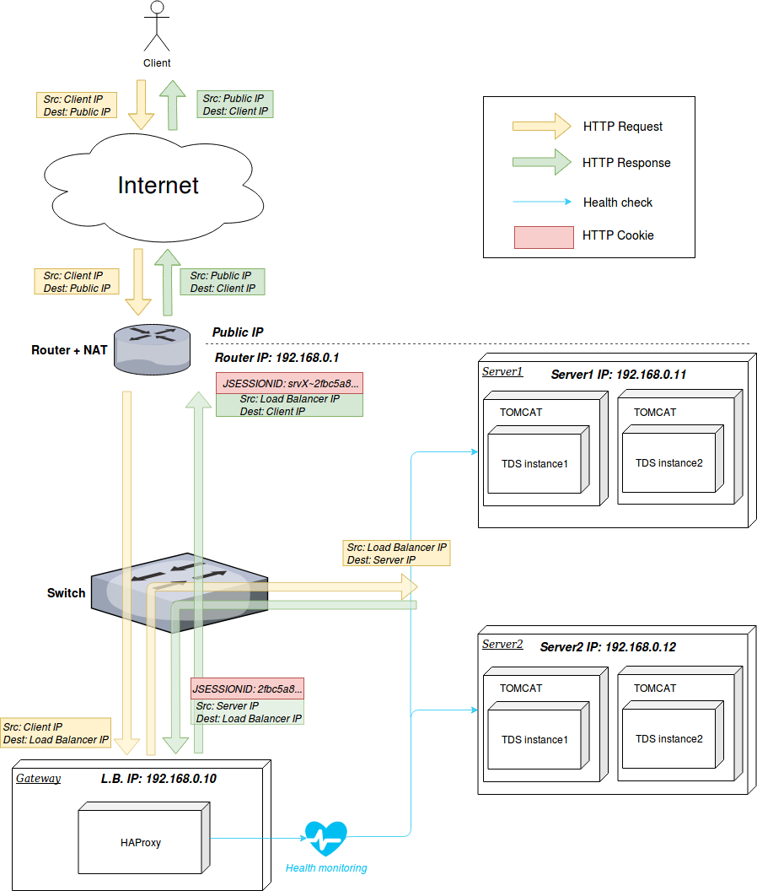
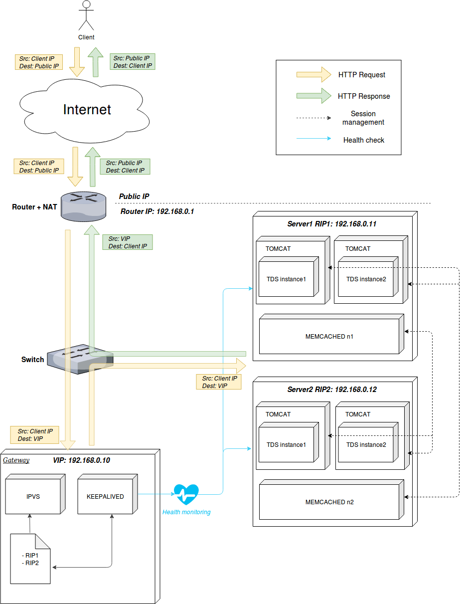
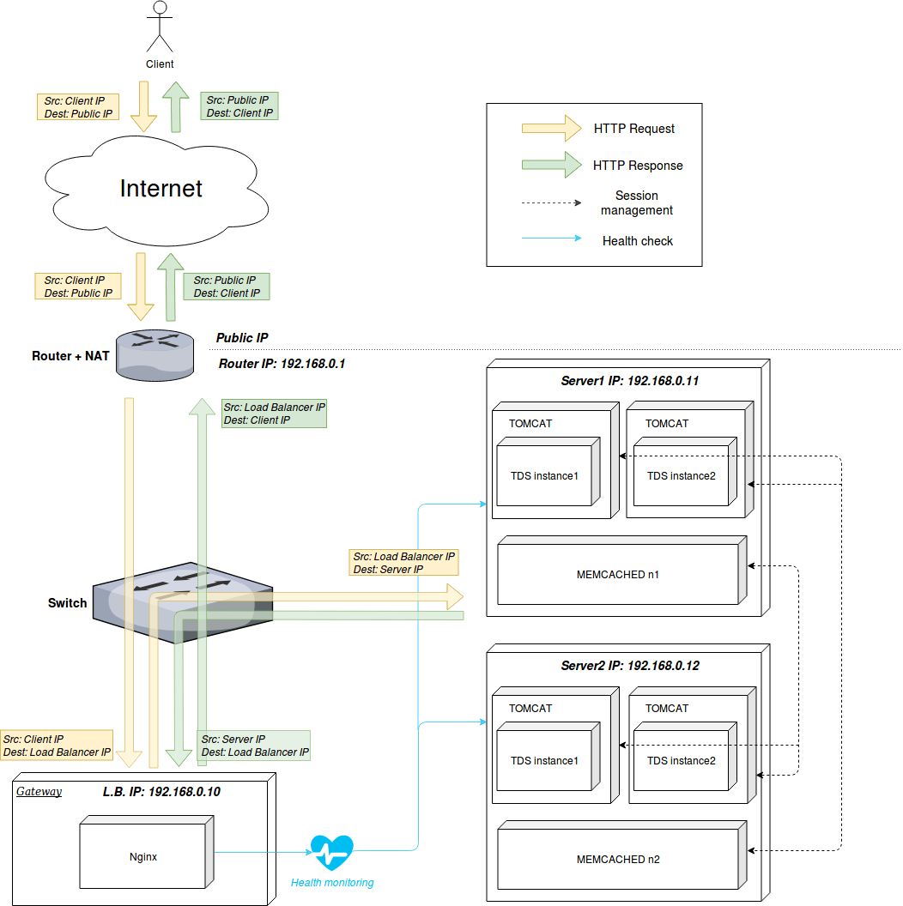

# Benchmarking #

In this scenario, different load balancing schemes are proposed with different solutions for availability, persistency, etc.

## HAProxy ##
HAProxy performs load balancing at Application Level (L7 in OSI model) mapping the URI from the request to a specific server or pool of servers (depending on, for example, the collection of datasets
requested) using HAProxy's ACLs. In addition to that, HAProxy performs periodic health checks to monitor the backend and keep a proper list of available servers.

Persistency is achieved using _sticky sessions_: HAProxy appends a small amount of information in the cookie passed to the client, so the Load Balancer knows to which server it has to pass the request.

## IPVS ##
IPVS performs load balancing at Transport Level (L4 in OSI model) with a Direct Server Return (DSR) scheme, so the server is able to answer directly to the client bypassing the load balancer. Although this 
scheme is expected to perform much better than the others thanks to that bypassing, it lacks the capacity to achieve persistency/session replication and to monitor the backend (which is fixed in [ipvs_memcached](./ipvs_memcached)
, using memcached and keepalived respectively).

## IPVS + Memcached ##
Here, IPVS performs load balancing at Transport Level (L4 in OSI model) with a Direct Server Return (DSR) scheme, so the server is able to answer directly to the client bypassing the load balancer. Also,
using Keepalived the load balancer is able to remove a server from the backend list when a fault occurs and adds it back when it recovers, using periodic health checks. In addition to that, Memcached allows 
for session replication between servers.

## Nginx + Memcached ##
Nginx performs load balancing at Application level (L7 in OSI model) mapping the URI from the request to a sepecific server or pool of servers (depending on, for example, the collection of datasets
requested). In addition to that, Nginx performs periodic health checks to monitor the backend and keep a proper list of available servers. An extra advantadge of using Nginx as the load balancer, is that
it can be also used as a web server to serve static content such as images, css files, etc. reducing overall network load.

Using _sticky sessions_ with Nginx is an option only included in the paid version, so Memcached is used to allow for session replication between servers.

